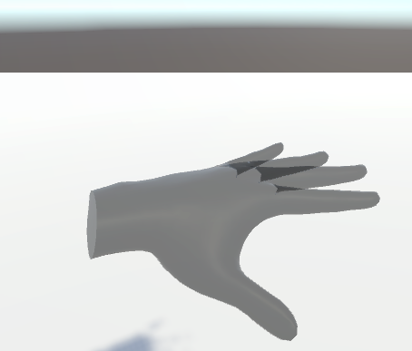
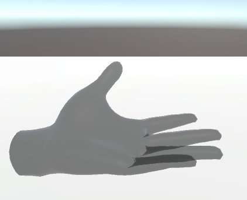
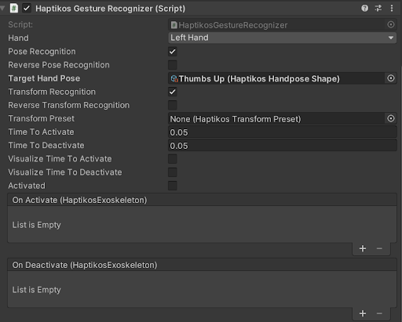

# Gestures

## Gesture Recognition

### Overview
This feature allows defining hand poses and determines whether the user is currently performing them. For example, recognizing when the user is making a fist (Hand Pose Recognition) or detecting the general direction of the hand, such as when the user’s palm faces the ground or the sky (Transform Recognition).

  
  
Figure 1: Open Hand Gesture and Palm Down

  
  
Figure 2: Open Hand Gesture and Palm Up

### Getting Started
To set up gesture recognition:
1. Add a `Haptik Gesture Recognizer` component to a GameObject or use the `Haptikos Panel`.
2. Configure the following:
   - `Hand`: Choose the hand to track.
   - `Target Hand Pose`: Select a predefined hand pose.
   - `Transform Preset`: Choose a preset that defines the hand's orientation.

A library of hand poses and transform presets is provided to simplify this process. For example, to create the gesture shown in Figure 1, select the `Open Hand` hand pose and the `Palm Down` transform preset. When the user performs the gesture, the `Activated` boolean will become true.

  
  
Figure 3: Haptikos Gesture Recognizer

### Adding Functionality
To add functionality to your gesture, use the Unity Events:
- `On Activate`: Triggered when the gesture is recognized (i.e., the `Activated` boolean becomes true).
- `On Deactivate`: Triggered when the gesture is no longer recognized (i.e., the `Activated` boolean becomes false).

These events are triggered only when the value of `Activated` changes between frames. If no changes occur, no events are triggered. Alternatively, if events are not ideal for your use case, you can directly reference the `Activated` boolean in your scripts.

## Raycasts

### Overview
A tool designed to replace the mouse and help the user interact with distant objects.

  
  
Figure 4: Haptikos Gesture Select

### Getting Started
Two raycast prefabs are available, preconfigured and ready to use. To set them up, simply select the hand that will project the ray. Additionally, there are pre-made selectable object prefabs that can interact seamlessly with these raycast prefabs.
The interactions between raycasts and selectable objects are the following:
- `Pinch Raycast` interacts with Button and Follow Ray.
- `Teleport Raycast` interacts with TeleportArea.

### Setting up an object to interact with raycasts:
For an object to interact with raycasts, the following should be true:
- The object has a **collider**.
- The object is on the **target layer** of the raycast. (For example, the teleport area prefab is on the teleport layer, and the teleport raycast has this layer as its only target.)
- A script implementing the `HaptikSelectable` class is attached.

We provide several ready-made selectable implementations, as well as examples with functionality, in the `Functional Selectables` folder of the SDK. For more details, refer to the `HaptikosSelectable` and `HaptikosRaycast` reference.

---

## Calibration in the SDK
The calibration process must be completed each time the exoskeleton is connected with a VR Headset. This process aligns the spatial frames of reference between the exoskeleton and the headset, effectively syncing them. If the direction of the hands on the screen displayed does not align with the real hands, the calibration process can be repeated. Holding the thumbs-up gesture for 3 seconds on both hands initiates this process. The scripts and GameObjects necessary for this process are baked in the `Haptikos Player`.

---

## Raycast Menu
A simple menu has been created to enable our ready-to-use cursor and teleport raycast. This menu can be found on the `HaptikosPanel` or alongside the other prefabs. To activate the menu, a gesture sequence must be performed on either hand: with the hand facing the camera, first perform the open-hand pose, followed by the fist gesture.

Setting up the raycast system and using the premade selectables is straightforward. Drag and drop the prefabs into the scene, press play, open the raycast menu, select a raycast, and begin using it. If testing a specific raycast without the menu is preferred, the raycast menu can be bypassed by directly dragging and dropping one of the raycast prefabs into the scene or using the `Haptikos Panel`.

### The ready-to-go selectables
- `Teleport`: Ground Area that allows the player to teleport around using the teleport raycast
- `FollowRay`: Attach to any game object with a collider and rigidbody. Then the user will be able to move it around using the cursor raycast

---

### Canvas and button prefabs
Drag the canvas into the scene and add buttons as its children. These buttons can then be treated as standard Unity UI buttons, interactable through both the cursor raycast and the hand models.
