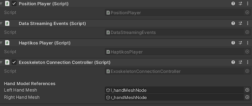
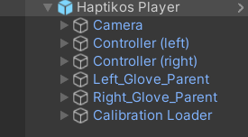

# Description of the Haptikos Player Prefab and Its Role

The `Haptikos Player` is the main prefab used throughout applications. It serves to stream data from the exoskeletons to the application and contains several key scripts and components critical for its operation.

## Haptikos Player Scripts

  
  
Figure 1: Haptikos Player Scripts

### Haptikos Player
This script is notable for its function that allows easy access to either the Left or Right Exoskeleton from any class through the static method:
`HaptikosPlayer.GetExoskeleton(HandType);`

- **positionReference**: Provides the position of the hand in space.
- **hand.joints**: Contains the position and rotation of each joint in the finger, as specified in the Hand class within the joints field.
- **pinching**: Indicates whether the user is currently pinching.

Additionally, this script manages the connectivity of the Exoskeleton with the **Haptikos Core Application**, facilitating the connection and disconnection processes.

## Structure of the Haptikos Player

  
  
Figure 2: Haptikos Player Hierarchy

### Haptikos Player Items
The `Haptikos Player` includes several key components essential for its functionality:

- **VR Camera**: The virtual reality camera component that provides the visual perspective for the user.
- **VR Controllers**: Devices that enable user interaction within the VR environment.
- **Left & Right Exoskeleton Parent**: These parent objects contain all the logic required for receiving data from the application and applying interaction logic to each finger. The **HaptikosExoskeleton** component within these parents provides detailed information about each hand and finger, crucial for developing custom applications.
- **CalibrationLoader**: Responsible for the IMU Calibration of the exoskeletons to ensure accurate tracking and alignment.

### Additional Scripts and Their Roles
- **Position Player**: This script recalibrates the player's position when the user wears the headset, ensuring it remains parallel to the floor.
- **Exoskeleton Connection Controller**: Controls the visibility of the hands, toggling their presence in the scene when a hand is connected or disconnected.
- **Data Streaming Events**: Manages events related to the connectivity of the exoskeletons, ensuring smooth transitions when these devices are connected or disconnected.

This comprehensive setup within the `Haptikos Player` allows for robust and responsive interaction within VR applications, leveraging the detailed data from the **Haptikos Exoskeletons**.