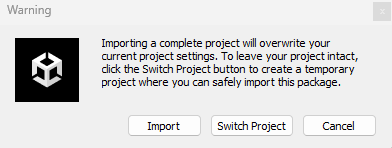
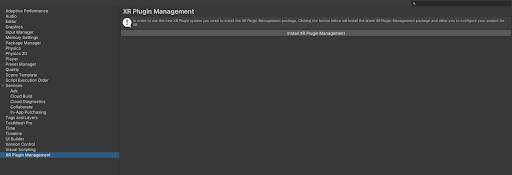
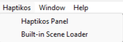
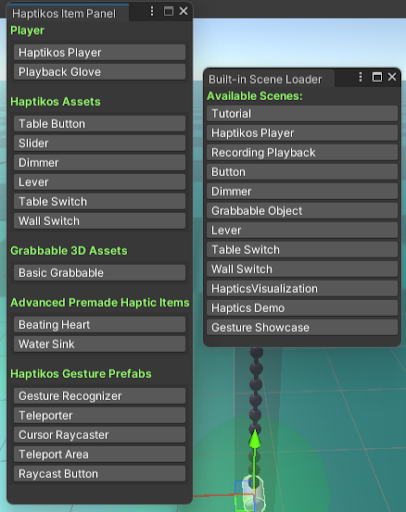
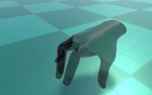

# Installation Guide in Unity

## Getting Started

The first step is to download the **Haptik_OS** Unity plugin from the following link: [Insert SDK download link] and ensure you are using Unity version 2021.3.25. Detailed instructions for downloading Unity are available at [Unity 2021.3.25](https://unity.com/releases/editor/whats-new/2021.3.25).

After downloading and setting up Unity and the SDK, exoskeletons become visible in the Unity environment.

## SDK Setup

Import the SDK as you would any `Unity Package`:

- Navigate to `Assets → Import Package → Custom Package`
- Select the `Haptik_OS SDK`.

After importing the SDK, preferably into an empty project, you will be prompted to import all the project settings.

  
  
Figure 1: Package Import

The SDK will override all the project settings (Tag, Layer & Build Settings), and import all the layers, tags, and built-in Unity scenes of the project. Click `Import` to include the above-mentioned necessary components.

Next, install the `XR Plugin Management` to connect any type of headset with the Unity project. This can be done by navigating to:

- `Player → Player Settings → XR Plugin Management`

  
  
Figure 2: Installing XR Plugin Management

After installing the `XR Plugin Management`, access the SDK's built-in panels for navigation which can be found in the top bar of Unity under the `Haptikos Panel`.

  
  
Figure 3: Haptikos Panel

These are the `Haptikos Item Panel` and `Built-In Scene Loader`.

  
  
Figure 4: Ready-made panels

`Haptikos Item Panel` allows you to load all the SDK's premade assets. Clicking on any item spawns it in the scene.

`Built-In Scene Loader` enables navigation through our premade scenes with a simple click on any button.

It is recommended to give quick access to these panels or place them in a dedicated window to simplify navigation within the SDK, eliminating the need to search for the prefabs.

> **Important Note:**  
> Avoid changing the folder location of the prefabs as this will break the Haptikos Item Panel.  
> To create new prefabs or variations, it is advisable to store them in a separate `Prefabs` folder, outside the `Haptik_OS SDK` folder.

Following the aforementioned procedure and connecting at least one exoskeleton, clicking on the `Haptikos Player` scene in the Haptikos Panel will open the scene where the player is displayed. By pressing play, the exoskeletons are activated in the scene and can be observed moving.

  
  
Figure 5: Haptikos Exoskeletons

